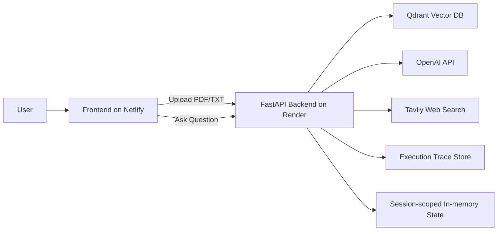
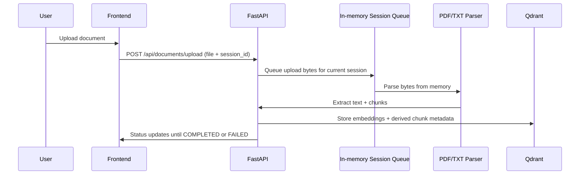
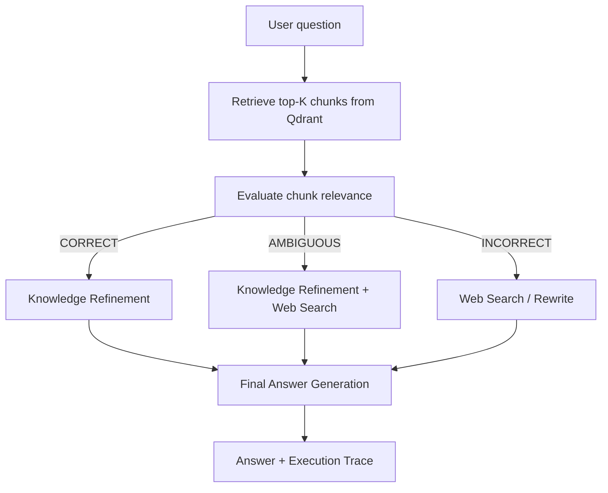

# Corrective RAG (CRAG) Dashboard

[](https://react.dev/)
[](https://www.typescriptlang.org/)
[](https://vitejs.dev/)
[](https://fastapi.tiangolo.com/)
[](https://qdrant.tech/)
[](https://platform.openai.com/)
[](https://render.com/)
[](https://www.netlify.com/)

An educational, production-deployed **Corrective Retrieval-Augmented Generation (CRAG)** dashboard inspired by NotebookLM-style workflows. The app shows how a question moves through retrieval, evaluation, routing, refinement, web search fallback, and final generation while exposing the execution trace in a visual pipeline.

## Highlights

- Interactive CRAG pipeline visualization with live node state
- Session-scoped document ingestion and querying
- In-memory upload handling, with no raw file persistence on disk
- Qdrant-backed vector retrieval with derived chunk storage
- Correct / Ambiguous / Incorrect routing with traceable decisions
- FastAPI backend and React + Vite frontend
- Production deployment on Render + Netlify

## Architecture



## How It Works

### Ingestion Flow



### Query Flow



## Decision Paths

- **Correct**: internal knowledge is sufficient, so the pipeline refines the retrieved context and generates an answer.
- **Ambiguous**: internal knowledge is partially useful, so the pipeline combines refined internal context with external search.
- **Incorrect**: internal retrieval is not trustworthy, so the pipeline falls back to web search / rewrite.

## Project Structure

```text
backend/   FastAPI app, ingestion, retrieval, evaluation, traces
frontend/  React dashboard, chat UI, document queue, graph visualizer
docs/      Architecture, pipeline, deployment, and implementation notes
```

## Tech Stack

- **Frontend**: React 19, TypeScript, Vite, Tailwind CSS, React Flow
- **Backend**: FastAPI, Python, Pydantic
- **Vector DB**: Qdrant Cloud
- **LLM / Embeddings**: OpenAI API
- **Web Search**: Tavily API
- **Deployment**: Netlify for frontend, Render for backend

## Privacy and Session Model

- The browser keeps only a **session id** in `sessionStorage`
- Raw uploads are processed **in memory**
- Raw files are not written to disk
- Qdrant stores only embeddings and derived chunk payloads
- Session cleanup removes expired session data after the TTL window

## Local Setup

### Backend

```bash
cd backend
python -m venv .venv
.venv\Scripts\Activate.ps1
pip install -r requirements.txt
uvicorn app.main:app --reload
```

### Frontend

```bash
cd frontend
npm install
npm run dev
```

## Environment Variables

### Backend

```env
OPENAI_API_KEY=sk-...
QDRANT_URL=https://your-cluster.cloud.qdrant.io
QDRANT_API_KEY=...
QDRANT_COLLECTION=crag_documents
TAVILY_API_KEY=...
ALLOWED_ORIGINS=https://your-netlify-site.netlify.app
FRONTEND_URL=https://your-netlify-site.netlify.app
BACKEND_URL=https://your-render-service.onrender.com
```

### Frontend

```env
VITE_API_URL=https://your-render-service.onrender.com/api
```

## Deployment

- **Frontend**: deploy `frontend/` on Netlify
  - Build command: `npm run build`
  - Publish directory: `dist`
- **Backend**: deploy `backend/` on Render
  - Start command: `uvicorn app.main:app --host 0.0.0.0 --port $PORT`

## Documentation

- [Project Scope](docs/01_PROJECT_SCOPE.md)
- [System Architecture](docs/02_SYSTEM_ARCHITECTURE.md)
- [CRAG Pipeline](docs/03_CRAG_PIPELINE.md)
- [Frontend Architecture](docs/05_FRONTEND_ARCHITECTURE.md)
- [API Contract](docs/06_API_CONTRACT.md)
- [Execution Trace](docs/07_EXECUTION_TRACE.md)
- [Vector Database](docs/08_VECTOR_DATABASE.md)
- [Prompts](docs/09_PROMPTS.md)
- [UI Design](docs/10_UI_DESIGN.md)
- [Deployment Guide](docs/11_DEPLOYMENT.md)

## Notes

- The app is designed as a single-dashboard educational experience.
- The graph view is driven by real execution trace data, not a hardcoded animation.
- The ingestion queue and query flow are session-scoped, which keeps the workspace isolated per browser session.
